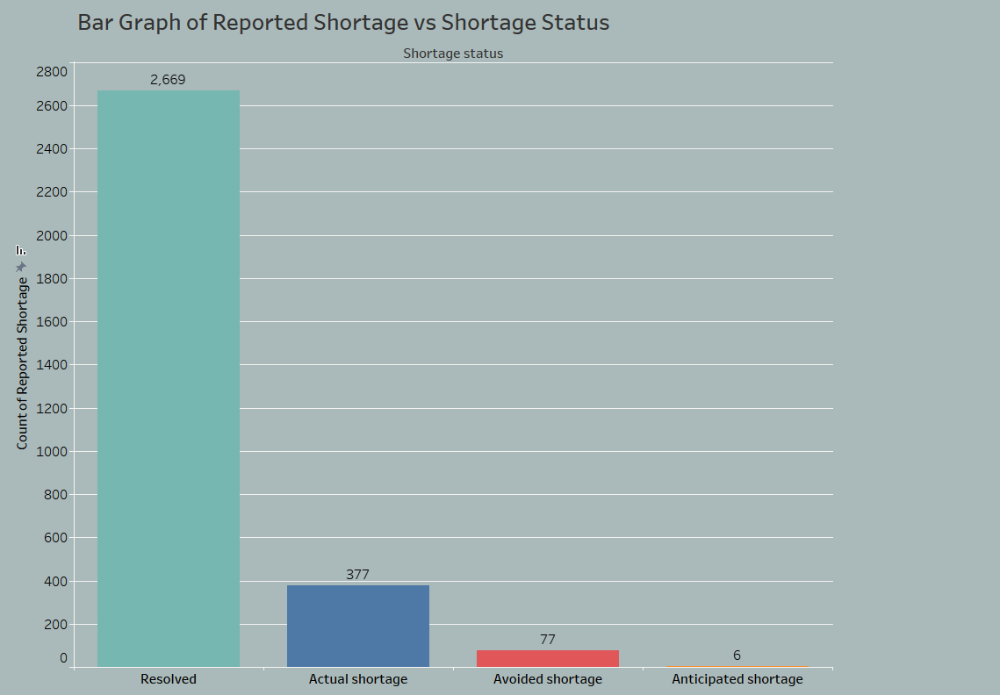
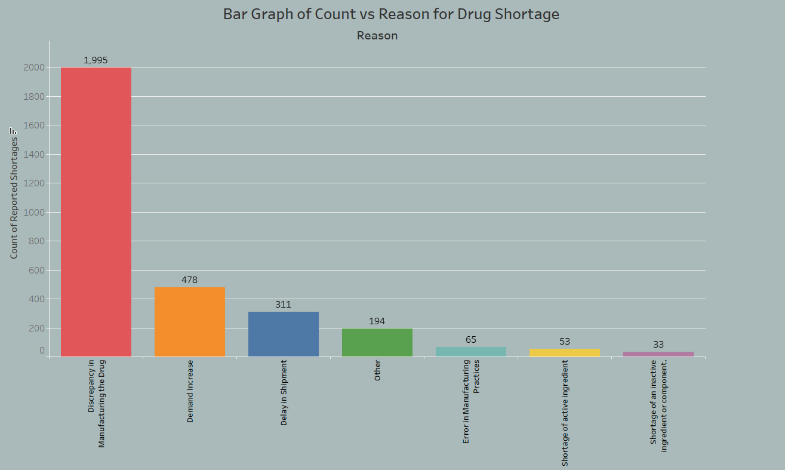
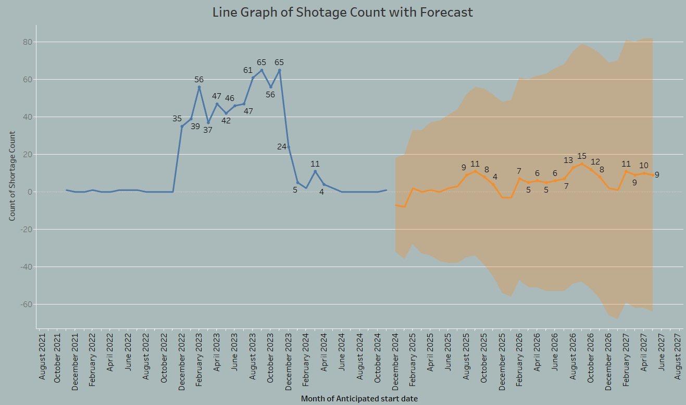
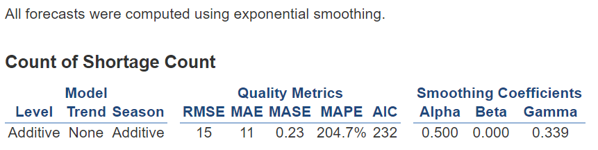
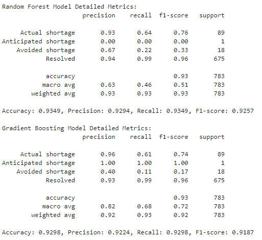

# Predictive-Analysis-on-Canadian-Drug-Shortages

## Project Overview

This project addresses the critical issue of drug shortages in Canada, leveraging machine learning techniques to predict shortages based on various factors such as supply chain dynamics, manufacturing disruptions, regulatory changes, and demand fluctuations. 

## Motivation 

As a Pharmacy Technician, I experience firsthand the challenges of managing medication supples or finding alternatives during when a drug becomes unavailable. This not only affects the pharmacy, but more importantly it critically impacts patient well-being as some of them depends on their medication. 

With over 20,573 unique drugs were reported using Drug Shortages Canada website as of November 2023. This project aims to develop a robust solution that helps mitigate this ongoing problem through predictive modeling. 

## Dataset 

The dataset was exported from Drug Shortages Canada's historical record feature; which is the official platform for reporting and accessing data on drug shortages and discontinuations in Canada. This data is maintained by markert authorization holders and is publicly accessible. 

#### Data Attributes

- Report ID
- Brand Name
- Company Name
- DIN (Drug Identification Number)
- Report Type
- Common Name
- Reason for Shortage
- Shortage Status
- Actual Start Date
- Estimated End Date

## Exploratory Data Analysis 

- Since the start of documenting shortages status in the [drugshortagescanada.ca](https://www.drugshortagescanada.ca/), we can see that the mojority falls in the resolved classification.
- Note that although these medications had been resolved, they were still previously considered "actually shorted" at some point.
- Currently there are 377 drugs on the market that are unable to be distributed or ordered.

- Majority of why drugs are unvailable falls into the "Discrepancy in Manufacturing the Drug" category.
- "Demand Increase" comes in second. Due to the posible relationship with seasonal trends like flu seasons.

- The high MAPE value suggest that while the model may be statistically fitting the data well in some respects (low RMSE, MAE, and MASE), it struggles with percentage-based predictions, potentially indicating large proportional errors for some predictions.
- Also as you can see based on the Predictioin Intervals which is the range of values that are likely to encapsulate the true value of the forecasted data points. Since there range is wide, it gives a sense of the uncertainty around the forecast. 

## Model Building

**1. Preprocessing:** Handling missing values and converting categorical values into machine-readable formats using one-hot encoding.

**2. Feature Engineering:** Extracting time-related features and applying Synthetic Minority Over-sampling Technique (SMOTE) to address data imbalances.

**3. Model Training:** Using ensemble methods such as Random Forest Classifier and Gradient Boosting Classifier.

**4. Hyperparameter Tuning:** Employing Randomized Search Cross Validation for efficient performance tuning.

**5. Model Testing and Evaluation:** Testing the models on unseen data and evaluating them using metrics like accuracy, precision, recall, and F1-score.

## Results 

- Both models shows promise in managing and predicting drug shortages, which is critical for the pharmacy industry to ensure reliable patient care and efficient drug distribution.
- Overall since the recall scores of Random Forest Model is slightly higher. This became the model of choice. 
- Since Recall scores considers to be the ability of the model to find all actual drug shortages. **This became the basis of what we were looking for in the model.** 

## Challenges and Future Goals 

- Overcome API limitations by directly exporting data from the website.
- Address class imbalances and refine hyperparameter tuning techniques.
- Use different hyperparameter tuning techniques to redistribute class weights.
- Future goals include building a predictive model that can more accurately anticipate drug shortages and creating an interactive application for business integration.

